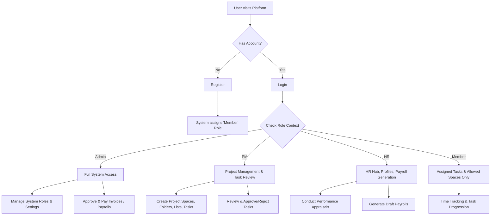
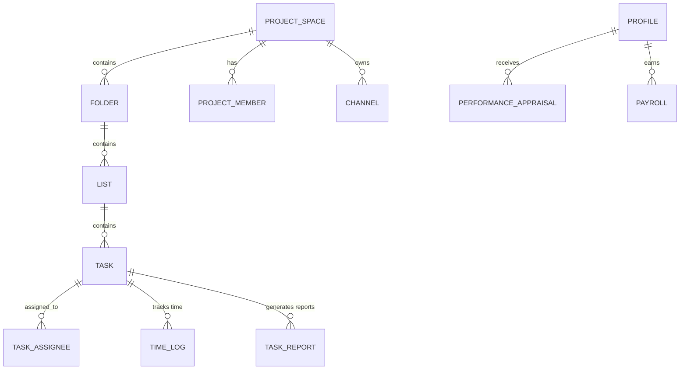
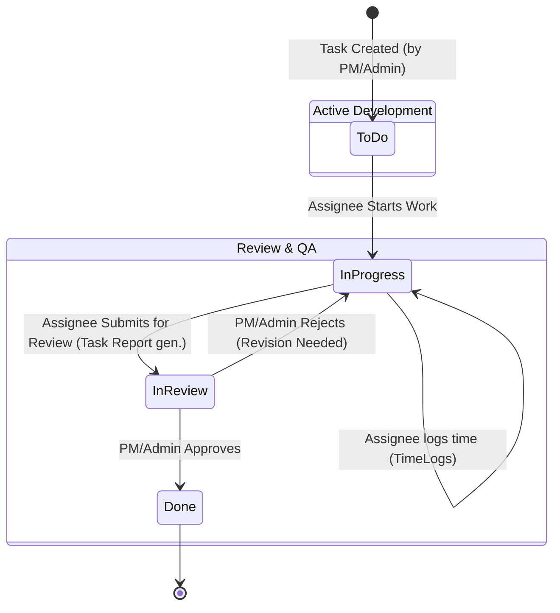
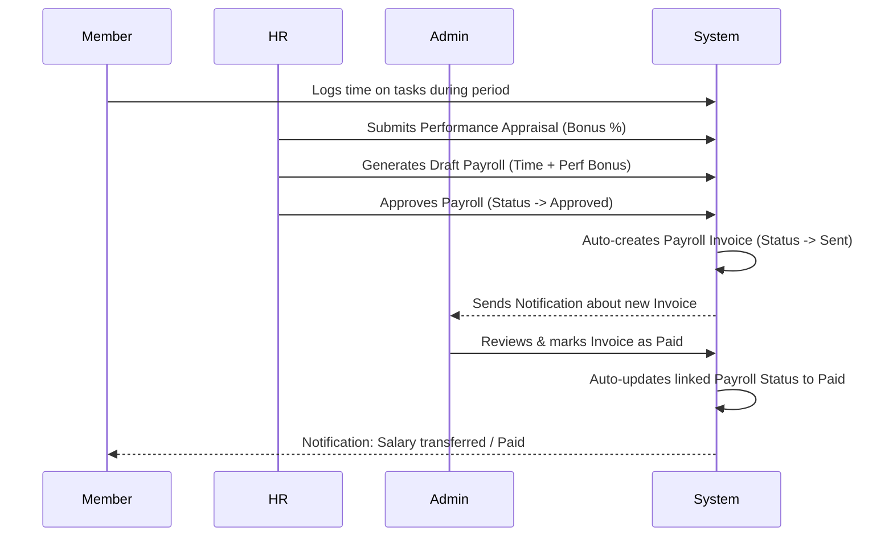
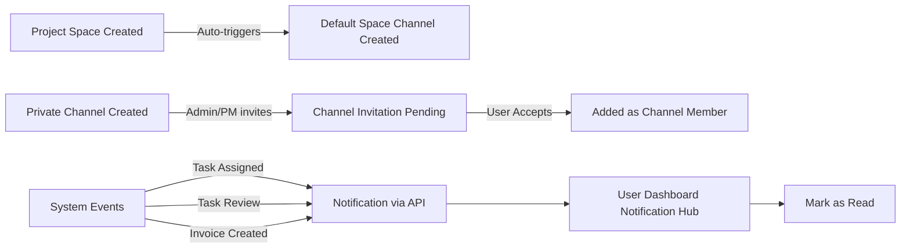

# CIRA Tech Management Platform - Flow Diagrams

This document outlines the core workflows, data structures, and state transitions within the CIRA Tech Platform.

## 1. System Access and Role Definitions

## 2. Project Hierarchy and Relationships

## 3. Task Status Lifecycle & Time Tracking

## 4. Payroll and Invoice Lifecycle (Financial Flow)

## 5. Communication and Notifications Flow

