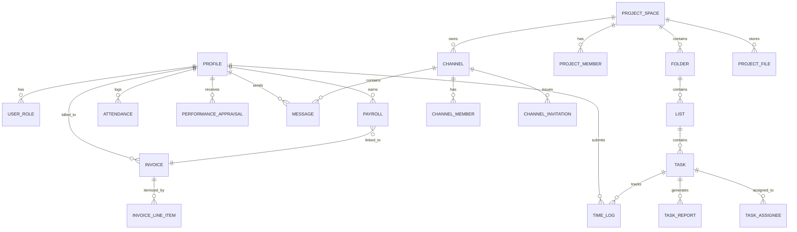

# Request for Proposal (RFP)
## CIRA Tech Management Platform — *Prism*

**Document Version:** 1.3 *(Updated: May 6, 2026 — Admin & PM Dual Role: Manager + Member in Any Project)*  
**Date:** May 6, 2026  
**Prepared By:** CIRA Tech Engineering Team  
**Project Codename:** `prism-sync-forge`

---

## 1. Executive Summary

CIRA Tech seeks proposals for the continued development, enhancement, and maintenance of **Prism** — an internal, all-in-one team management platform. Prism consolidates project management, human resources, financial operations, real-time communication, and analytics into a single cohesive product used internally across the organization.

The platform is composed of:
- A **React + Vite** frontend (`prism-sync-forge`)
- A **.NET 9 Web API** backend (`Prism.API` / `Prism.Domain`)
- A **SQLite** embedded database (production-ready migration path to PostgreSQL)
- **JWT-based authentication** with a multi-tier role system

---

## 2. Current System Overview

### 2.1 Technology Stack

| Layer | Technology |
|---|---|
| Frontend | React 18, TypeScript, Vite, TailwindCSS, shadcn/ui |
| Backend | .NET 9 Web API (ASP.NET Core) |
| Database | SQLite (via Entity Framework Core) |
| Auth | JWT Bearer Tokens (RS256-style HS256 symmetric key) |
| Testing | Vitest (unit), Playwright (E2E) |
| CI/CD | GitHub Actions (`.github/`) |

### 2.2 Architectural Layers

```
Prism.Domain        ← Pure entities & enums (no external deps)
Prism.API           ← Controllers, Services, DTOs, EF Core DbContext
prism-sync-forge    ← React frontend consuming the REST API
```

---

## 3. Business Logic Scope

### 3.1 Identity & Access Control

The system enforces **Role-Based Access Control (RBAC)** across all modules. Every authenticated user holds exactly one of the following roles:

| Role | Permissions Summary |
|---|---|
| `SuperAdmin` | Unrestricted access to all system features |
| `Admin` | Creates projects, assigns PMs, manages finances. **Dual role:** can also join any project as a Member and work on tasks there |
| `PM` | Manages tasks & members in their assigned project. **Dual role:** can also join other projects as a Member and work on tasks there |
| `HR` | Manages employee profiles, attendance, appraisals, and payroll generation |
| `Member` | Works on assigned tasks, logs time — only sees projects they belong to |
| `Guest` | Read-only, restricted-scope access |

**Policy Matrix (Backend Enforcement):**

```
SuperAdminOnly  → SuperAdmin
AdminOnly       → SuperAdmin, Admin
AdminOrPM       → SuperAdmin, Admin, PM   (scoped — PM limited to own projects)
HROrSuperAdmin  → SuperAdmin, HR
AdminOrHR       → SuperAdmin, Admin, HR
AdminPMorHR     → SuperAdmin, Admin, PM, HR
NotGuest        → SuperAdmin, Admin, PM, HR, Member
```

> [!IMPORTANT]
> **Scoped Access Rule:** `Admin` and `SuperAdmin` see **all** projects. `PM` sees only projects where they are the assigned manager (`manager_id`). `Member` sees only projects where they are an explicit `ProjectMember` or have a task assigned to them.

#### Auth Workflow

```
Register → Email/Password stored as BCrypt hash
Login    → Validate hash → Issue signed JWT (configurable expiry)
Request  → Bearer token validated on every protected endpoint
         → Role claim extracted → determines management scope
         → ProjectMember records → determines task/member scope
```

> [!NOTE]
> A user's **system role** (Admin, PM, Member…) governs what they can *manage*. Their **ProjectMember records** govern which projects they can *participate in and receive tasks from*. These two are independent — an Admin can be a Member in a project they did not create.

---

### 3.2 Project Hierarchy

The project structure follows a strict 4-level hierarchy:

```
ProjectSpace  ← Created exclusively by Admin; PM assigned as manager
  └── Folder
        └── List
              └── Task  ← Assignees must be ProjectMembers of this space
```

#### ProjectSpace
- Created **exclusively by `Admin`** (or `SuperAdmin`)
- Admin sets `manager_id` to a user with the `PM` role when creating or editing the project
- Automatically provisions a **default communication channel** upon creation
- Members are attached via `ProjectMember` junction records
- Can have associated `ProjectFile` attachments
- **Visibility:** `Admin`/`SuperAdmin` → all projects; `PM` → only where `manager_id = self`; `Member` → only where in `ProjectMember` or has an assigned task

#### Folder & List
- Created by `Admin` or the project's assigned `PM`
- Organizational grouping within a space
- Lists are the direct containers for tasks

#### Task
- Created by `Admin` or the project's assigned `PM`
- Has a **status lifecycle** (see §3.3)
- Has a **priority level**: `Low`, `Medium`, `High`, `Urgent`
- **Assignee Eligibility:** any user who is a `ProjectMember` of the same space — this explicitly includes the project's `PM` and any `Admin` who is a member of the project
- **Assignee Constraint:** `assignee_id` is validated against `ProjectMembers(space_id)` at the API level — users outside the roster cannot be assigned
- Can have a `ReviewerId`, an estimated hour count, and a due date
- Generates `TimeLog` records during active work
- Generates a `TaskReport` when submitted for review

---

### 3.3 Task Status Lifecycle

```
[ToDo] ──► [InProgress] ──► [InReview] ──► [Done]
                ▲                │
                └────────────────┘  (PM/Admin rejects → back to InProgress)
                               │
                               └──► [Rejected]  (terminal rejection)
```

**Transition Rules:**

| From | To | Actor |
|---|---|---|
| `ToDo` | `InProgress` | **Any Assignee** — Member, PM, or Admin acting as a project participant |
| `InProgress` | `InReview` | **Any Assignee** — triggers `TaskReport` generation |
| `InReview` | `Done` | PM (in their managed project) / Admin |
| `InReview` | `InProgress` | PM (in their managed project) / Admin — revision requested |
| `InReview` | `Rejected` | PM (in their managed project) / Admin — terminal |

> [!NOTE]
> When a task moves to `InReview`, the system automatically records who the reviewer is (`reviewer_id`) and timestamps the review (`reviewed_at`).

---

### 3.4 Time Tracking

Members log time against active tasks using `TimeLog` records:

| Field | Description |
|---|---|
| `task_id` | The task being worked on |
| `user_id` | The employee logging time |
| `start_time` | ISO 8601 timestamp |
| `end_time` | ISO 8601 timestamp |
| `hours_logged` | Computed decimal hours |
| `description` | Optional work notes |

- Time logs feed directly into **payroll calculations**
- Overtime is computed based on `hours_per_week` defined on the employee profile
- A **background service** (`DeadlineNotificationService`) monitors task due dates and fires notifications

---

### 3.5 HR Hub

The HR module covers the full employee lifecycle within the platform.

#### 3.5.1 Employee Profiles

Each user has an extended `Profile` record beyond basic auth:

| Field Group | Fields |
|---|---|
| Identity | `full_name`, `email`, `phone` |
| Contract | `contract_type` (FT / PT / FL), `hours_per_week` |
| Compensation | `hourly_rate`, `base_salary` |
| Banking | `bank_name`, `account_number`, `iban`, `payment_method` |
| Status | `is_active`, `is_deleted` |

#### 3.5.2 Attendance

- Tracks daily `check_in` / `check_out` timestamps per employee
- HR and Admin can view attendance records for reporting

#### 3.5.3 Performance Appraisals

- Conducted by `HR` role
- Captures a performance score / bonus percentage per employee per period
- Directly used as a bonus multiplier in payroll calculation

#### 3.5.4 Payroll Generation Workflow

```
HR generates Draft Payroll
  → Input: period_start, period_end, base_salary, time_logs, appraisal bonus
  → Calculation: base + (overtime_hours × hourly_rate) + bonuses − deductions + reimbursements

HR approves Payroll (status: Draft → Approved)
  → System auto-creates a linked Payroll Invoice (status: Sent)
  → Admin is notified

SuperAdmin reviews and marks Invoice as Paid (status: Sent → Paid)
  → System auto-updates linked Payroll (status: Approved → Paid)
  → Member receives "Salary Paid" notification
```

**Payroll Status States:** `Draft` → `Approved` → `Paid`

---

### 3.6 Financial Management (Invoices)

Invoices are first-class entities covering multiple business scenarios:

| Invoice Type | Description |
|---|---|
| `Payroll` | Auto-generated when payroll is approved |
| `Tools` | Manual — software/SaaS subscriptions |
| `Hardware` | Manual — physical equipment |
| `Services` | Manual — external service providers |

**Invoice Status States:** `Draft` → `Sent` → `Paid`

**Auto-Numbering Logic:**
- Format: `INV-{YEAR}-{SEQ:000}` (e.g., `INV-2026-001`)
- Sequence is scoped per calendar year
- On system startup, back-fills any invoices missing a number

Each invoice contains:
- One or more `InvoiceLineItem` records (description, quantity, unit price, tax rate)
- A computed `sub_total`, `tax_amount`, and `total_amount`
- Optional linkage to a `ProjectSpace` and a `Payroll` record

---

### 3.7 Communication & Notifications

#### Channels

- Each `ProjectSpace` auto-creates a **default public channel** on creation
- Admins/PMs can create **private channels**
- Members are added via `ChannelInvitation` (Pending → Accepted/Rejected flow)
- `ChannelMember` junction tracks active membership

#### Messages

- Users send messages within channels
- Messages are scoped to a `channel_id` and authored by `user_id`

#### Notifications

The notification system is event-driven and covers:

| Trigger Event | Recipients |
|---|---|
| Task assigned to user | Assignee |
| Task moved to InReview | Reviewer (PM/Admin) |
| Task approved / rejected | Assignee |
| Payroll Invoice created | Admin |
| Invoice marked Paid | Employee |
| Channel invitation sent | Invitee |
| Task deadline approaching | Assignee (background service) |

Notifications carry a `type`, `title`, `message`, `is_read` flag, and optional `related_channel_invitation_id`.

---

### 3.8 Dashboard & Reporting

The `DashboardController` aggregates cross-domain KPIs:

- **Task Metrics:** Total, by status, by priority, overdue counts
- **Time Metrics:** Total hours logged per period, per user, per project
- **Financial Metrics:** Invoice totals by status, payroll summaries
- **HR Metrics:** Active employees, pending appraisals, upcoming payroll periods

The `Reports` module (`Reports.tsx`) provides detailed drill-down views with filtering by project, user, and date range.

---

## 3.9 Project Ownership, Member Assignment & Task Eligibility

This section is the authoritative reference for the scoped-access model.

---

### A. Project Creation — Admin Only

```
POST /api/projects
  → Requires: AdminOnly policy
  → Body includes: pm_id (Guid) — the PM user to be assigned as manager
  → Sets: space.manager_id = pm_id
  → Auto-creates: default channel for the space
  → Auto-adds: PM as first ProjectMember (so PM appears in assignee list immediately)
```

---

### B. Project Visibility Filtering

When `GET /api/projects` is called, the backend applies role-based query scoping:

| Caller Role | Filter Applied |
|---|---|
| `SuperAdmin` / `Admin` | No filter — returns **all** active projects |
| `PM` | `WHERE manager_id = currentUserId` — only projects they manage |
| `Member` / `HR` / `Guest` | `WHERE currentUserId IN ProjectMembers(space_id)` OR has an assigned task in the space |

---

### C. PM: Assigning Team Members to a Project

Once Admin creates a project and assigns the PM, the PM gains the ability to **manage the project's member roster** (scoped to their own project only):

```
POST /api/projects/{id}/members
  → Requires: PM is manager_id of space {id}
  → Body: { "user_ids": ["guid1", "guid2"] }
  → Adds each user as a ProjectMember of the space
  → Effect: added members now appear in the task assignee dropdown for this project

DELETE /api/projects/{id}/members/{userId}
  → Requires: PM is manager_id of space {id}
  → Removes the member from the project roster
  → Does NOT unassign existing tasks (those remain; tasks just become unresolvable for new assignments)
```

> [!IMPORTANT]
> A PM can **only manage members** of the specific project they are assigned to. They cannot view or modify member rosters of any other project.

**Who can the PM add as members?**
- Any active (`is_active = true`, `is_deleted = false`) user in the system with any role
- The frontend assignee picker filters the system user list to active users
- The PM themselves is automatically a member (added at project creation)

---

### D. PM Permissions Within Assigned Projects

| Action | Permission Rule |
|---|---|
| `PUT /api/projects/{id}` | Allowed only if `manager_id = currentUserId` → else `403 Forbidden` |
| `DELETE /api/projects/{id}` | `AdminOnly` — PM **cannot** delete a project |
| `POST /api/projects/{id}/members` | Allowed if `manager_id = currentUserId` |
| `DELETE /api/projects/{id}/members/{uid}` | Allowed if `manager_id = currentUserId` |
| `POST /api/tasks` (in this project) | Allowed if `manager_id = currentUserId` |
| `PUT /api/tasks/{id}` (in this project) | Allowed if `manager_id = currentUserId` |
| `DELETE /api/tasks/{id}` (in this project) | Allowed if `manager_id = currentUserId` |

---

### E. Task Assignee Eligibility

Eligible assignees for a task in project space `S` are **all active `ProjectMember` records for space `S`**.

Because Admin and PM carry a **dual role**, their eligibility is identical to any other user: they must have a `ProjectMember` record for the space — regardless of whether they manage it.

| User Type | Eligible? | Reason |
|---|---|---|
| `Member` added to project | ✅ Yes | Has `ProjectMember` record for the space |
| The project's `PM` (own project) | ✅ Yes | Auto-added as `ProjectMember` at creation |
| `PM` added to a **different** project as Member | ✅ Yes | Has `ProjectMember` record for that space |
| `Admin` added to a project as Member | ✅ Yes | Has `ProjectMember` record for the space |
| `Admin` NOT in the project's member list | ❌ No | Must be explicitly added first |
| User from a project they don't belong to | ❌ No | No `ProjectMember` record |

> [!IMPORTANT]
> **Admin and PM are not automatically members of every project.** Being an Admin gives you *management* access to all projects (read/update), but to **receive tasks** in a specific project you must be an explicit `ProjectMember` of that space.

**API Enforcement:**

```
POST /api/tasks  (or PUT /api/tasks/{id})
  → Resolve task's ListId → Folder → ProjectSpace → space_id
  → For each assignee_id in request:
      Check: assignee_id IN ProjectMembers WHERE space_id = resolved space_id
      If not found → 400 Bad Request:
        { "error": "User {id} is not a member of this project" }
  → Only if all assignees pass → proceed to save
```

> [!CAUTION]
> This check applies to **all roles equally** — a user's system role (Admin, PM, Member) does not bypass the `ProjectMember` check when assigning tasks.

---

### F. How Admin or PM Joins a Project as a Member (Dual Role)

Admin and PM can work **both** as managers (in their management scope) **and** as regular task-executing members in any project. This is the dual-role workflow:

#### Scenario 1: Admin joins a project to work on tasks
```
1. Any Admin (or PM who manages the project) calls:
   POST /api/projects/{id}/members
   Body: { "user_ids": ["<admin-user-id>"] }

2. Admin is now a ProjectMember of space {id}
3. Admin appears in the task assignee dropdown for this project
4. Admin receives tasks, logs time, submits for review — exactly like a Member
5. Admin still retains their global management privileges in parallel
```

#### Scenario 2: PM joins a different project to work on tasks
```
1. The managing Admin (or the target project's PM) adds the PM:
   POST /api/projects/{other-project-id}/members
   Body: { "user_ids": ["<pm-user-id>"] }

2. PM is now a ProjectMember of that other project
3. PM can receive tasks there and work on them as a regular member
4. PM still manages their own assigned project in parallel
5. PM does NOT gain management rights in the other project — only participation rights
```

> [!NOTE]
> When a PM or Admin is acting on an assigned task (starting work, logging time, submitting for review), the system treats them identically to a `Member` for that task — no special privileges apply.

#### Summary: Role vs. Participation Scope

| Dimension | Governed By |
|---|---|
| What you can *manage* (projects, tasks, users, finances) | **System Role** (Admin / PM / HR / Member) |
| Which projects you can *participate in and receive tasks from* | **`ProjectMember` records** |
| Whether you can be assigned a task | **`ProjectMember` record exists for that space** |

---

### G. Create Project & Assign PM — API Contract

```http
POST /api/projects
Authorization: Bearer <admin_token>
Content-Type: application/json

{
  "name": "Project Alpha",
  "description": "...",
  "pm_id": "<pm-user-guid>",
  "total_budget": 50000,
  "start_date": "2026-06-01",
  "end_date": "2026-12-31"
}
```

**Response:** `201 Created` — `manager_id` = `pm_id`, PM auto-added as `ProjectMember`.

---

### H. Reassign PM — API Contract

```http
PATCH /api/projects/{id}/manager
Authorization: Bearer <admin_token>
Content-Type: application/json

{ "pm_id": "<new-pm-user-guid>" }
```

**Effect:** Updates `manager_id`. Old PM loses write access to the project immediately. New PM gains scoped access and is added as `ProjectMember` if not already present.

---

## 4. API Surface Summary

| Controller | Endpoints (approx.) | Auth Policy |
|---|---|---|
| `AuthController` | Register, Login, Me | Public / Authenticated |
| `ProjectsController` | Create (Admin only) + Assign PM, PM assigns members (scoped), CRUD Files | `AdminOnly` (create/reassign-PM) / `AdminOrPM` (scoped update/member-mgmt) |
| `TasksController` | CRUD Tasks (PM scoped to own project), Status transitions, Assignees validated against `ProjectMembers` — Admin & PM both task-eligible | `AdminOrPM` (scoped) / `NotGuest` |
| `TimeLogsController` | Log/view time per task | `NotGuest` |
| `TaskReportsController` | Generate/view task reports | `NotGuest` |
| `PayrollsController` | Generate, approve, pay payrolls | `HROrSuperAdmin` |
| `InvoicesController` | CRUD Invoices, mark paid (SuperAdmin only) | `AdminOnly` / `NotGuest` |
| `ChannelsController` | CRUD Channels, invitations, membership | `AdminOrPM` / `NotGuest` |
| `MessagesController` | Send/list messages | `NotGuest` |
| `NotificationsController` | List/mark-read notifications | Authenticated |
| `ProfilesController` | View/update user profiles | `HROrSuperAdmin` / Authenticated |
| `PerformanceController` | Appraisals CRUD | `HROrSuperAdmin` |
| `FoldersController` | CRUD Folders | `AdminOrPM` |
| `ListsController` | CRUD Lists | `AdminOrPM` |
| `DashboardController` | Aggregate KPIs | Authenticated |

All endpoints return JSON with **snake_case** property names. Null values are omitted from responses.

---

## 5. Data Model Summary



---

## 6. Non-Functional Requirements

| Category | Requirement |
|---|---|
| **Security** | All endpoints require JWT Bearer auth except `/auth/login` and `/auth/register`. Passwords stored as BCrypt hashes. Role policies enforced at controller level. |
| **Performance** | Rate limiting applied via `RateLimitService` (singleton). Background service runs on configurable intervals without blocking request threads. |
| **Reliability** | Soft-delete pattern (`is_deleted`) used on critical entities (Profile, Task) to prevent data loss. |
| **Scalability** | EF Core abstraction allows migration from SQLite to PostgreSQL with minimal changes. |
| **Observability** | Swagger/OpenAPI documentation auto-generated in development mode. |
| **CORS** | Configurable allowed origins via `appsettings.json`; defaults to `localhost:5173` and `localhost:8080`. |

---

## 7. Scope of Proposal

Vendors responding to this RFP are expected to address the following:

### 7.1 Feature Enhancements
- [ ] Real-time messaging using WebSockets (SignalR)
- [ ] File preview support within project file management
- [ ] Advanced reporting & CSV/PDF export
- [ ] Multi-language / i18n support

### 7.2 Infrastructure & DevOps
- [ ] Containerization (Docker + docker-compose)
- [ ] PostgreSQL migration with full data seeding
- [ ] CI/CD pipeline completion and deployment automation
- [ ] Environment-specific configuration management

### 7.3 Quality & Testing
- [ ] Expand Playwright E2E test coverage to all major workflows
- [ ] Add integration tests for all API controllers
- [ ] Performance benchmarking and load testing

### 7.4 Security Hardening
- [ ] Refresh token rotation
- [ ] Rate-limit configuration per role/endpoint
- [ ] Audit log trail for sensitive actions (payroll approval, invoice payment)

---

## 8. Submission Requirements

Proposals must include:

1. **Technical Approach** — Methodology, architecture decisions, technology choices
2. **Team Composition** — Roles, experience, availability
3. **Timeline** — Phased delivery milestones aligned to the scope above
4. **Budget Breakdown** — By feature area and phase
5. **References** — Comparable platform projects delivered

---

*This document is confidential and intended solely for evaluation purposes.*
